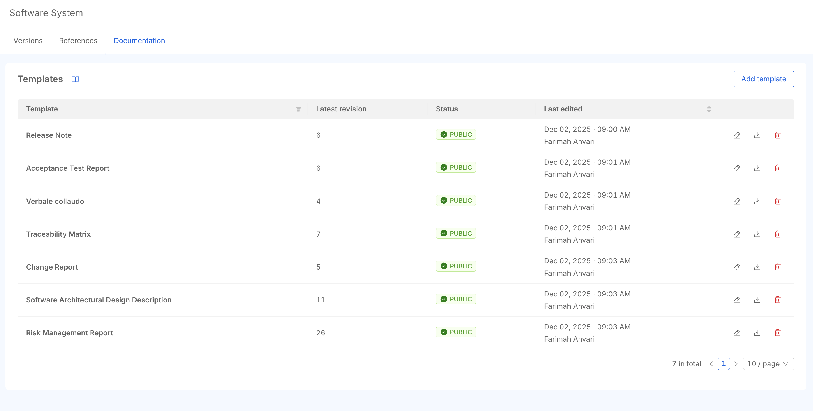

# Documentation engine

## Overview
This module offers a centralized Documentation Engine to streamline compliance by automating the generation of regulated artifacts. 
A default set of IEC 62304-compliant templates is provided to allow users a quick startup: templates can be extensively customized thanks to our editor (.markdown, .docx) and enriched by system data through provided variables and custom structure. 
The documentation shaped from the templates can be generated and downloaded in the preferred format for every version of your Software System. 



## Features

### Template Management

P4SaMD provides a default set of templates to help you start with a IEC 62304-compliant framework. 
For enabled users, it is always possible customize and manage templates: 
- **Creating** new templates to extend the default template set
- **Editing** a template, to align the structure to your company QMS and the deliverables required for your product. 
- **Publishing** a template to make it visible in the System Version Dashboard and ready for the documentation download
- **Deleting** the templates when no more needed (the records would be archived in P4SaMD database, but not available to users) 

For each template the following informations are available:

- **Title**:  Changeable title for the template
- **Revision**: Automatic version tracking for the published templates.
- **Last Edit Date/Time**: Timestamp of the most recent modification
- **Editor**: User who performed the last edit
- **Status**: Template state indicator
    - `Draft`: Template in progress
    - `Published`: Template available for use
- **Actions**: Available actions per template row (based on user permissions):
    - `Edit/View`: Modify or view template content
    - `Download`: Export template file
    - `Delete`: Remove template from system

### Automatic Document Generation

## Variables and Data Interpolation
The documentation engine supports dynamic content generation using predefined variables. Possible variables are defined in the variable list: you can either copy-paste int the templates or write them manually follwing the specific syntax format `{{CATEGORY.variable_name}}`.
These variables are automatically populated with actual data when generating the documentation in a specific System Version. 
**Available Categories:**
- `BUG`
- `CHANGE_REQUEST`
- `CURRENT_USER`
- `GENERAL`
- `REQUIREMENT`
- `RISK`
- `SOFTWARE_ITEM`
- `SYSTEM_VERSION`
- `TEST`
- `TEST_EXECUTION`
- `TEST_SUITE

## Custom Lists and Tables
For data which are not unique, such as the Requirements of a System Version, custom structure are available to organized the actual data. 
In Custom Lists, organize the structure of the appeareance of 1 item and it will be repeated for all the existing entities of that item. 
```
{{#each CATEGORY}}
{{variable_name}}
{{/each}}
```
For instance, to print the list (as title) of all the requirements for a specific System Version, you need to insert in your template the related loop for requirements:
```
{{#each REQUIREMENT}}
{{title}}
{{/each}}
```
**NB** Some categories may have nested data, constited in list of elements related to an element available in the custom lists. Loops inside loops are allowd for those nested data.

**Image Management:**
To include images in your document:
1. Insert a placeholder in your template where the image should appear
2. Generate and download the report
3. Manually add the downloaded image to the placeholder location

For instance, Software Item design image can be downloaded from the System Version Dashboard and attached dinamically to the generated .markdown documnet following the previous steps.  


## Revision Management

The system automatically maintains revision history for each published template without requiring manual intervention. When a template is published, the revision number increments automatically with each subsequent modification and save operation.

**Key Features:**
- Automatic version increment on save for published templates
- Complete change history tracking
- Ability to restore previous revisions

### Error Management

The editor includes built-in validation that alerts users to syntax errors in variables or loop structures.


### Report and Template Generation

**Template Download:**
Raw templates can be downloaded directly from the template table without data interpolation.

**Report Generation:**
Once a template is published, it becomes available in the reports list on the overview tab. Published templates can be used to generate reports with interpolated data.

**Supported Formats:**
Both templates and reports are available in `Markdown` and `Docx` formats.
