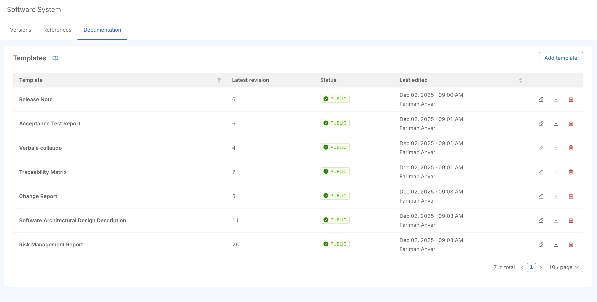

# Documentation engine

## Overview
This module centralizes and automates the generation of regulated artifacts.
A default set of IEC 62304-compliant templates is provided. Templates can be customized in the editor (.markdown, .docx) and enriched with system data through the provided variables and custom structure.
The documentation shaped from the templates can be generated and downloaded in the preferred format for every version of your Software System.



## Features

### Template Management

P4SaMD provides a default set of templates as a starting point for an IEC 62304-compliant framework.
Enabled users can customize and manage templates:
- **Creating** new templates to extend the default template set
- **Duplicating** an existing template to use it as a starting point for a new one
- **Editing** a template, to align the structure to your company QMS and the deliverables required for your product
- **Publishing** a template to make it visible in the System Version Dashboard and ready for the documentation download
- **Deleting** the templates when no more needed (the records are archived in the P4SaMD database, but not available to users)

Each template shows:

- **Title**:  Changeable title for the template
- **Revision**: Automatic version tracking for published templates.
- **Last Edit Date/Time**: Timestamp of the most recent modification
- **Editor**: User who performed the last edit
- **Status**: Template state indicator
    - `Draft`: Template in progress
    - `Published`: Template available for use
- **Actions**: Available actions per template row (based on user permissions):
    - `Edit/View`: Modify or view template content
    - `Duplicate`: Open the editor pre-filled with a copy of the template content and title.
    - `Download`: Export template file
    - `Delete`: Remove template from system

## Automatic Document Generation

The Documentation Engine generates compliance documents by combining published templates with real-time system data.


### Variables and Data Interpolation
The documentation engine supports dynamic content through predefined variables. Possible variables are defined in the variable list: copy and paste them into the templates, or write them manually with the syntax `{{CATEGORY.variable_name}}`.
Variables are populated with actual data when you generate the documentation for a specific System Version.
**Available Categories:**
- `BUG`
- `CHANGE_REQUEST`
- `CURRENT_USER`
- `GENERAL`
- `REQUIREMENT`
- `RISK`
- `SOFTWARE_ITEM`
- `SYSTEM_VERSION`
- `TEST`
- `TEST_EXECUTION`
- `TEST_SUITE

### Custom Lists and Tables
For data which is not unique, such as the Requirements of a System Version, custom structures organize the actual data.
In Custom Lists, define the appearance of one item and it is repeated for all the existing entities of that item.
```
{{#each CATEGORY}}
{{variable_name}}
{{/each}}
```
To list all the requirements of a specific System Version by title, insert the requirements loop in your template:
```
{{#each REQUIREMENT}}
{{title}}
{{/each}}
```
**NB** Some categories have nested data: lists of elements related to an element available in the custom lists. Loops inside loops are allowed for that nested data.

**Image Management:**
To include images in your document:
1. Insert a placeholder in your template where the image should appear
2. Generate and download the report
3. Manually add the downloaded image to the placeholder location

For instance, the Software Item design image can be downloaded from the System Version Dashboard and attached to the generated .markdown document with these steps.


### Revision Management

Once a template is published, its revision number increments with each subsequent modification and save.

**Key Features:**
- Automatic version increment on save for published templates
- Complete change history tracking
- Restore previous revisions

### Error Management

The editor validates syntax and alerts users to errors in variables or loop structures.


### Report and Template Generation

**Template Download:**
Raw templates can be downloaded directly from the template table without data interpolation.

**Report Generation:**
Once published, a template appears in the reports list on the overview tab and can generate reports with interpolated data.

**Supported Formats:**
Both templates and reports are available in `Markdown` and `Docx` formats.
