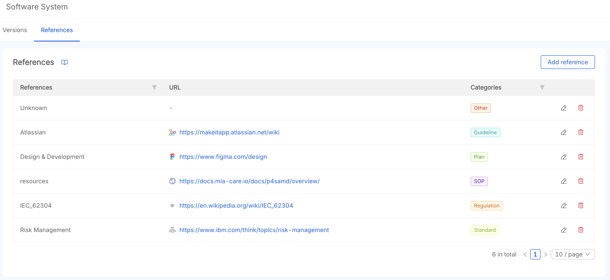

# References

Add links to documentation and resources related to your SaMD projects, such as regulations, guidelines and mockups. Your team members reach them directly from Mia-Care P4SaMD.

## Overview

The table lists each project reference with its name, URL, and category. Open it from the **References** tab on the product page.

## 1. Create a Reference

To add a reference:

1. **Click the "Add reference" Button**
   This opens a modal to create a new reference.

2. **Fill in the Required Fields**  
   Fill out the following fields:
   - **Reference title**: the name of the reference (e.g. *GDPR*).
   - **Reference URL**: the URL of the reference
   - **Reference category**: the type of reference, you can choose between:
     - `Plan`
     - `SOP`
     - `Standard`
     - `Regulation`
     - `Guideline`
     - `Other`

3. **Save the New Reference**  
   Click the **"Add Reference"** button at the bottom of the modal to save the new reference.

## 2. Reference Table

Each reference holds:

- **Title** (required): The name of the reference.
- **URL**: The URL to the reference web page
- **Category** (required): The category of the reference.

## 3. Reference Actions

In the last column, click the icons to edit or remove a reference. Once removed, a reference is permanently deleted and cannot be recovered.
