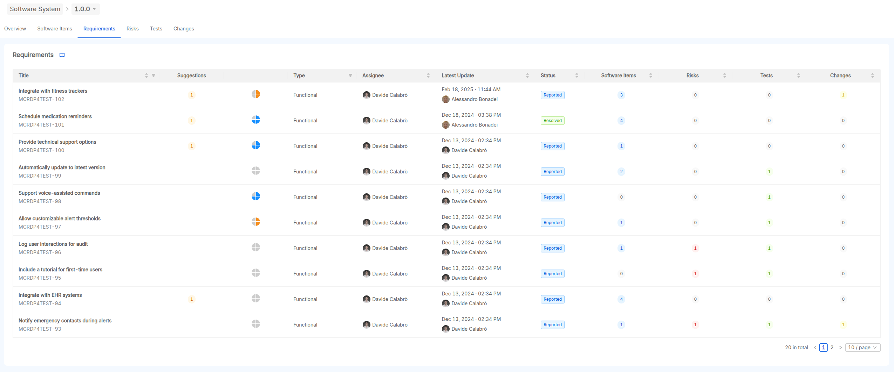

The section allows users to view requirements created on the integrated ALM and use AI to evaluate them and collect suggestions for improvement according to *IEC 62304*.

In the requirements table you can see an icon indicating the evaluation status of each requirement:

| Evaluation        | Icon | Details |
|-------------------|------|---------|
| Missing           |      |         |
| In progress       |      |         |
| Very low quality  |      |         |
| Low quality       |      |         |
| High quality      |      |         |
| Very high quality |      |         |

## Evaluate requirement with AI

You can assess the conformity of a SaMD requirement according to the *IEC 62304* by hovering on the gray icon in the corresponding table row and click on the **Evaluate** button.

The assessment may take a while, usually around a minute, so while we process it in the background you can keep working on P4SaMD and come back to check the progress at any time.

After the evaluation has been completed, the spinner will assume different colors depending on the overall rating and hovering on the icon you can get a preview:

TODO Screenshot of modal

| Evaluation        | Preview |
|-------------------|-------|
| Very low quality  |       |
| Low quality       |       |
| High quality      |       |
| Very high quality |       |

The rating provides an overall score, which is the result of the aggregation of four different scores on specific criteria:

- **Clarity and Specificity**: if the requirement is clear, detailed and unambiguous;
- **Traceability**: if the requirement is uniquely identified and is linked to risks and software items;
- **Testability and Verification**: if the requirement is easy to test and verify;
- **Completeness**: if the requirement contains all information expected by *IEC 62304*.

If you select the row, you can see in the modal on the right side detailed information about the evaluation under the **Suggestions** table:

TODO screenshot of drawer

At the top you can see a **suggested description**, which provides an example of how you could rewrite your requirement to address its main weaknesses.

Also, you can check how it scored on each specific criteria mentioned above, including the specific areas of strength and weakness.

