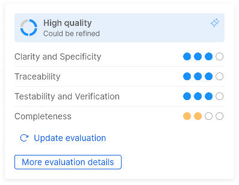

# Requirements

## Overview

The section provides a complete overview of Software System requirements of the selected version. The main information are displayed in the table and additional details can be found by clicking on a table row, accessing the requirement drawer.

The requirements displayed in the table originate from the integrated ALM, where they are created, updated, and edited. The table dynamically reflects any changes made inside the ALM.  

Furthermore, the user is assisted evaluating the design inputs of the project thanks to the AI-powered evaluation features: the users can leverage AI to evaluate requirements and collect suggestions for improvement according to *IEC 62304*.

## Table

- **Title**: A brief description of the requirement and a link to the Jira Issue represented by its Key.
- **Suggestions**: The number of suggestions related to the requirement.
- **Quality**: the latest evaluation performed using AI, see a legend of the different icons below. 
- **Type**: the requirement type (functional, regulatory, security, etc.).
- **Assignee**: the Jira user assigned to the requirement.
- **Latest Update**: who performed the last update to the requirement and when. 
- **Status**: the status of the requirement (opened, closed, etc.)
- **Software Items**: the number of software items affected by the requirement.
- **Risks**: the number of risks mitigated by the requirement.
- **Tests (test coverage)**: the number of tests verifying the requirement. 
- **Changes**: the number of changes applied to the requirement.

The table presents an overview of the traceability, through the count of linked entities such as software items, tests, risks and changes.

Additional information are provided by suggestions generated by a rule engine, configured with IEC 62304 deterministic rules, and are displayed under the **Suggestions** column. For further details, please refer to [Insight and Suggestions](./insight_and_suggestions.md).

Under the **Quality** column, you can see the following icons indicating the evaluation status of each requirement. For further details, please refer to the [AI evaluation](#ai-evaluation) section.

| Evaluation        | Icon                                                                                          |
|-------------------|-----------------------------------------------------------------------------------------------|
| Missing           |          |
| Very low quality  |    |
| Low quality       |             |
| High quality      |           |
| Very high quality |  |

### Actions

Under the last column on the table you can perform the following actions:

- **Link Software Items**: by clicking on the link icon, you can link a new software item to the requirement or unlink an already associated one. The linked software items are displayed in the drawer under the **Traceability** tab.

## Drawer

Clicking on a table row opens a **drawer** displaying detailed information about the selected requirement.

The drawer shows requirement related information into three tabs:

**Details**: Beyond the information displayed in the table, it shows:
  - **Title**: A brief description of the requirement and a link to the Jira Issue represented by its Key.
  - **Description**: A paragraph describing the risk.
  - **Type**: the requirement type (functional, regulatory, security, etc.).
  - **Assignee**: the Jira user assigned to the requirement.
  - **Latest update**: when the last update was performed on the requirement. 
  - **Latest executor**: who performed the last update to the requirement. 
  - **Mockup reference**: an external link to the mockups the requirements is based on. 
  - **Mockup status**: the status of the mockup (in progress, approved, etc.). 
  - **Status**: the status of the requirement (opened, closed, etc.)

**Traceability**: Shows the linked issues of the requirement grouped by:
  - **[Software Items](./software_items.md)**
  - **[Risks](./risks.md)**
  - **[Tests](./verification.md)** 
  - **[Changes](./changes)**

**Suggestions**: Shows related suggestions of the requirement.

## AI evaluation

:::danger

When performing an evaluation using AI, Assignee, Reporter and Approver information are not provided to AI. Requirement title, description and other information, including related risks, tests and software items, are shared with AI service.

Do not insert any personal or sensitive information in the AI-process fields.
For more details about third-party organizations privacy and security measures, please check the [FAQ section][faq-data-sharing].

Also remember that information generated by AI may be inaccurate or misleading, so never make any assumption or decision based solely on those information and always verify them.

:::

You can assess the conformity of a SaMD requirement by hovering on the icon under the Quality column in the corresponding table row and click on the `Get evaluation` button.

The assessment may take a while, usually around a minute, so while we process it in the background you can keep working on P4SaMD and come back to check the progress at any time.

After the evaluation has been completed, the icon on the table is going to assume different colors depending on the overall rating and, by hovering it, you can see a preview of the results.

| Evaluation        | Preview                                                                                               |
|-------------------|-------------------------------------------------------------------------------------------------------|
| Very low quality  |    |
| Low quality       |              |
| High quality      |            |
| Very high quality |  |

The rating provides an overall score, which is the result of the aggregation of four different scores on specific criteria:

- **Clarity and Specificity**: if the requirement is clear, detailed and unambiguous;
- **Traceability**: if the requirement is uniquely identified and is linked to risks and software items;
- **Testability and Verification**: if the requirement is easy to test and verify;
- **Completeness**: if the requirement contains all information expected by *IEC 62304*.

If you select the row, in the modal on the right side of the page, under the **Suggestions** tab, you can see detailed information about the evaluation.
At the top you can see a **suggested description**, which provides an example of how you could rewrite your requirement to address its main weaknesses.
Also, you can check how it scored on each specific criteria mentioned above, including the specific areas of strength and weakness.

[faq-data-sharing]: ../faq.md#does-mia-care-p4samd-share-data-with-third-party-organizations
