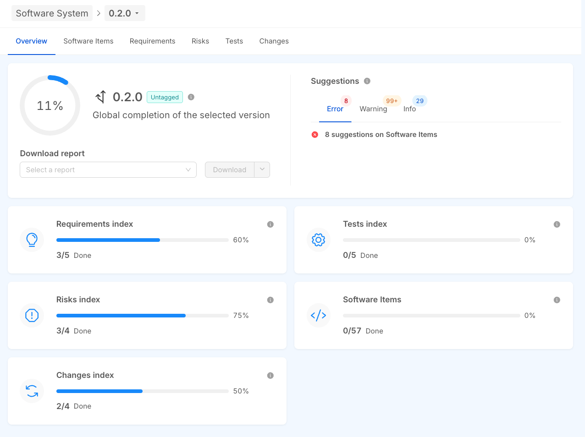

# System Overview

## Introduction
The **Overview** tab summarizes the progress and key metrics for the selected **system version**. When you choose a system version, the tab automatically updates to show all the information tied to that version.

## KPIs
At the core of the Overview tab, a global **progress bar** shows the overall **completion percentage** of the entities associated with the selected system version. Each Key Performance Indicator (KPI) is the ratio of **correctly resolved issues** to the **total number of issues** for that entity.

Below the global progress bar, **detailed progress bars** break down the completion status for each type of entity:
- **Requirements**: Tracks the implementation and approval status of defined requirements.
- **Risks**: Reflects the identification, assessment, and mitigation of risks.
- **Tests**: Monitors the execution and success of validation and verification activities.
- **Software Items**: Tracks the completion and review status of individual software components.
- **Change Requests**: Shows the resolution of requested changes across the system version.

## Reports
Use the **select dropdown menu** directly beneath the overall progress bar to generate and download reports for the selected system version.

These reports are available as `Default` templates:
- **Release Note**: Summarizes the key updates, features, and resolved issues in the system version.
- **SOUP Report**: Details the use of all Software of Unknown Provenance (SOUP).
- **Changelogs**: A folder with the changelog of each custom software component.
- **Unit Tests**: Outcomes and coverage of the unit tests performed on custom software components.
- **Vulnerability Report**: Summary and details of the vulnerabilities detected in the system version.
- **Software architecture Design**: The high-level design of the software items, as an image.

These reports are provided as a startup package of customizable templates:
- **Release Note**: Summarizes the key updates, features, and resolved issues in the system version.
- **Acceptance Test Report**: Results of the acceptance testing that verifies the system against its specified requirements.
- **Verbale collaudo**: The official test acceptance record (Italian compliance document).
- **Traceability Matrix**: Maps the relationships between requirements, design elements, tests, and other artifacts to ensure full traceability.
- **Change Report**: All changes made to the system version, including modifications, additions, and deletions.
- **Software Architectural Design Description**: Describes the high-level software architecture, including components and interfaces.
- **Risk Management Report**: Lists the identified risks, their assessments, and mitigation strategies.

These reports support compliance, traceability, and audit or external review.

### Custom Reports
Create additional custom reports by designing templates in the documentation engine. Once published, a template appears in the dropdown menu and can be downloaded for any system version. See the [Documentation Engine](document-engine.md).

For more about the available reports, see the [dedicated section](reports.md).

## Suggestions
On the right-hand side of the Overview tab, the **Suggestions box** lists recommendations for complying with the regulations that govern Software as a Medical Device (SaMD) development, such as **IEC 62304**.

Suggestions are categorized into three levels of severity:
- **Error**: Critical issues that must be addressed immediately to meet compliance and avoid major risks.
- **Warning**: Issues that are not critical but could lead to compliance gaps or delays if not resolved.
- **Info**: Non-mandatory recommendations or observations on process efficiency and documentation quality, such as optimization opportunities or additional audit notes.
