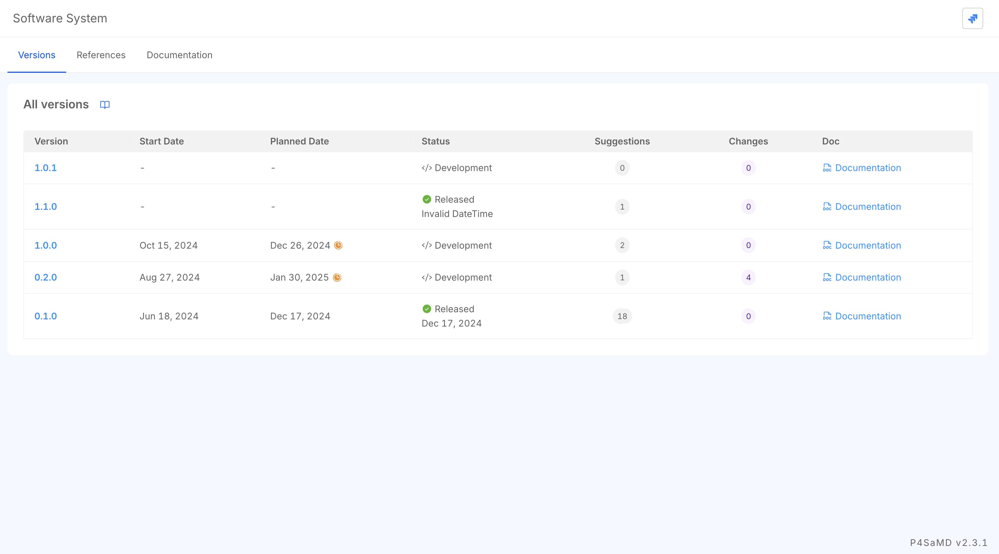

# System Versions

## Overview
This table lists the system versions of the P4SaMD project with their statuses, planned release dates, and documentation.

## Configuration in Jira
The P4SaMD project is configured in **Jira**, where all versions and their details are managed. Each version in the table corresponds to a **Jira project version**, so the data displayed is pulled directly from Jira. Version updates, such as a release, are made in Jira and appear in this table automatically.

## Quick Access to Last Worked Version
**Quick Access** resumes work on the last version you used. The system remembers the previously accessed version and directs you to it when you return, instead of requiring you to select it from the table again.

## Table Column Descriptions
- **Version**: The specific system version (e.g., 1.1.0, 1.0.1) as defined in Jira.
- **Start Date**: The date when work on this version began.
- **Planned Date**: The estimated release date of the version.  

  |  | This icon means the release date has passed. Hover over it to see the number of days elapsed since the scheduled release date. |
  | ------------------------------------------------ | --------------------------------------------------------------------------------------------------------------------------------------------------------------- |

- **Status**: The current development phase (e.g., "Development" or "Released").
- **Suggestions**: The number of suggestions or feedback items related to this version.
- **Changes**: The number of changes or modifications applied to the version.
- **Doc**: A quick link to the documentation associated with the version.

