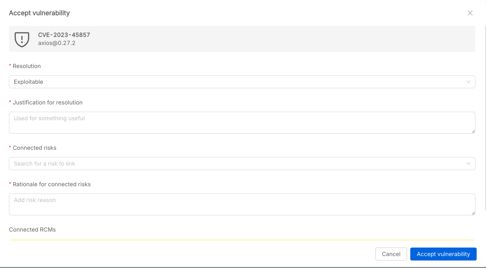

## Vulnerabilities Overview

The **Vulnerabilities** section allows users to monitor, analyze, and manage vulnerabilities detected in the Software Items of the Software System Version. Vulnerabilities are automatically detected using [Trivy](https://trivy.dev/) for software items that have a repository ID and import the P4SaMD pipelines `cve-generation-trivy.yml` and `send-cve-to-p4samd-webhook.yml`.

### Vulnerabilities Table

The vulnerabilities table provides an overview of all vulnerabilities related to all the implementation of the Software Item. The following information is shown:

- **Vulnerability Name**: Name of the CVE (linked to the external advisory).
- **Reported On**: Date when the vulnerability was reported.
- **Last Pipeline Run**: Date of the last pipeline execution that detected the vulnerability.
- **Software Item Version**: Version of the Software Item where the vulnerability was found.
- **Branch**: Branch where the vulnerability was found.
- **CVSS**: Trivy severity score and categorization.
- **Affected Library**: Library where the vulnerability was found.
- **Risks**: Number of risks connected to the acceptance of the vulnerability.
- **Mitigation (RCM)**: Number of RCMs connected to related risks.
- **Resolution**: Resolution value of the accepted vulnerability.
- **Status**: Status of the vulnerability (Open or Accepted).
- **Actions**:  
    - **Accept/Revert Acceptance**: Accept or revert acceptance of the vulnerability.
    - **Edit vulnerability**: Open a modal to edit the accepted vulnerability.

Clicking on a row opens the vulnerability detail drawer.

---

### Vulnerability Detail Drawer

Clicking on a vulnerability opens a drawer with detailed information, organized in two tabs:

#### Detail

- **CVE link**: Direct link to the external advisory.
- **Fix version**: Versions where the vulnerability is fixed.
- **Status**: Current status (Open, Accepted).
- **Reported on** and **Last pipeline run**.
- **CVSS**: Severity score and level.
- **Title** and **Description**: Details about the vulnerability.
- **Resolution**: How the vulnerability was resolved or justification for acceptance.
- **Rationale for connecting risks**: Explanation for any linked risks.
- **Actions**: Accept or revert acceptance of the vulnerability.

#### Traceability

This tab shows the linked issues, grouped by:

- **[Software Items](./software_items.md)**
- **[Risks](./risks.md)**
- **[RCM](./requirements.md)** 

---

### Accepting or Reverting a Vulnerability

#### Accept Vulnerability Flow

When accepting a vulnerability, the user must provide:

- **Resolution**: The chosen resolution (Exploitable, Not exploitable, Exploitable with minor damage).
- **Justification for resolution**: Reason for the chosen resolution.
- **Connected risks**: Risks linked to the vulnerability.
- **Rationale for connected risks**: Explanation for the risk linkage.
- **Connected RCMs**: (if any) mitigation measures.

#### Revert Vulnerability Acceptance

If a vulnerability was previously accepted, it is possible to revert the acceptance. A confirmation modal will appear to prevent accidental actions.

---

:::info
All vulnerability management actions are tracked and auditable.  
Vulnerabilities must be resolved or justified to ensure compliance with security requirements.
