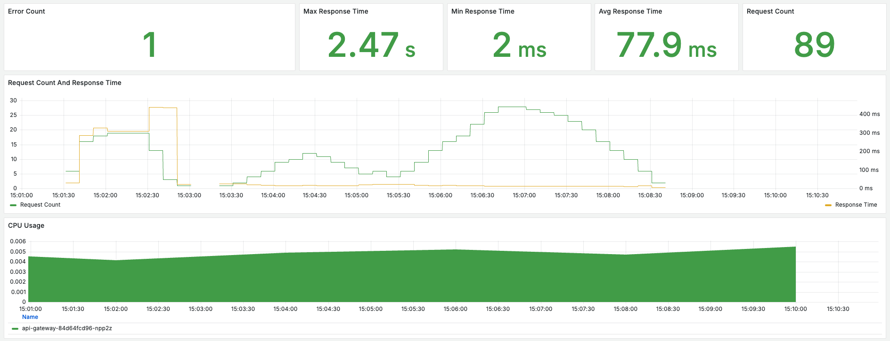
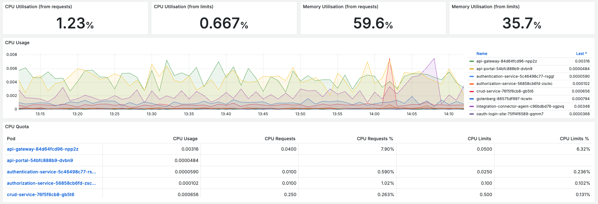

# Monitoring Mia-Care P4SaMD

The Mia-Care team installs Mia-Care P4SaMD following the right configuration and installation procedure, and sets up the monitoring dashboards. Dashboards can be modified to match customer needs.

The recommended monitoring tool is the Grafana suite:

- **Prometheus**: collects and queries metrics.
- **Loki**: aggregates and queries logs.
- **Fluentd**: collects and forwards logs.
- **Fluentbit**: a lightweight log processor and forwarder.
- **Mimir**: scalable, long-term storage of metrics.

Other monitoring and logging stacks are supported, but the customer sets them up. Mia-Care can assist with dashboards and alerts for these alternative stacks.

## Default Monitoring Dashboards

The default monitoring setup contains these dashboards:

- **API Gateway Dashboard**: traces API calls to the Mia-Care instance, showing error requests, average response time, and the number of requests.

- **Resource Consumption**: traces resource consumption on the Kubernetes (k8s) runtime, covering CPU, memory usage, and other critical resources.

## Alarms for Active Monitoring

The Mia-Care team also sets up basic alarms on the Mia-Care P4SaMD instance. These alarms include:

- **Error Count**: raised if the number of requests that generate an error (4xx and 5xx status code replies) is greater than 5 within a timing window, usually 10 minutes.
- **Average Response Time**: raised if the average response time is greater than 1 second within a timing window, usually 10 minutes.

## Customizing Monitoring

The default monitoring setup is designed to cover the most common use cases and can be customized. Customizations may include:

- Adding new dashboards to monitor additional metrics.
- Modifying existing dashboards to include more detailed information.
- Setting up additional alarms for other critical metrics.

Contact the Mia-Care support team for any change to the monitoring setup.

## Alert Channels and Receivers

By default, all alerts are sent to the Mia-Care team. During the installation phase, the customer is also asked to provide the channels to set up for alerts and the receivers of those alerts. Examples of available channels include:

- Email
- Google Chat
- Slack
- Microsoft Teams

## Accessing Monitoring Dashboards

To access the monitoring dashboards:

1. Log in to the Mia-Care monitoring portal using your credentials.
2. Navigate to the "Dashboards" section.
3. Select the desired dashboard (e.g., API Gateway Dashboard, Resource Consumption) to view the metrics.

## Conclusion

For further assistance, contact the Mia-Care support team.
