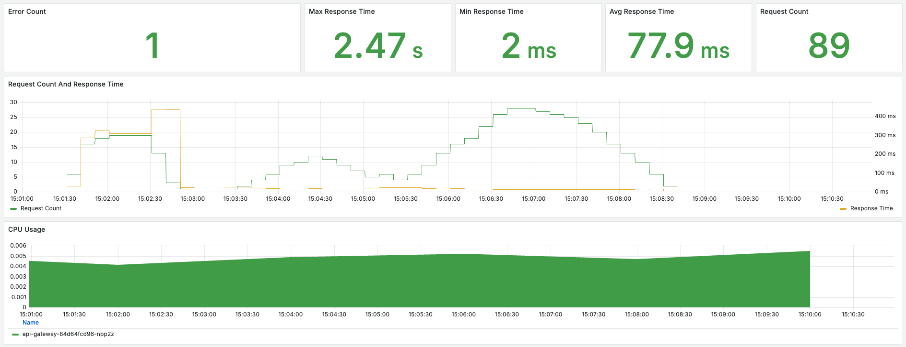
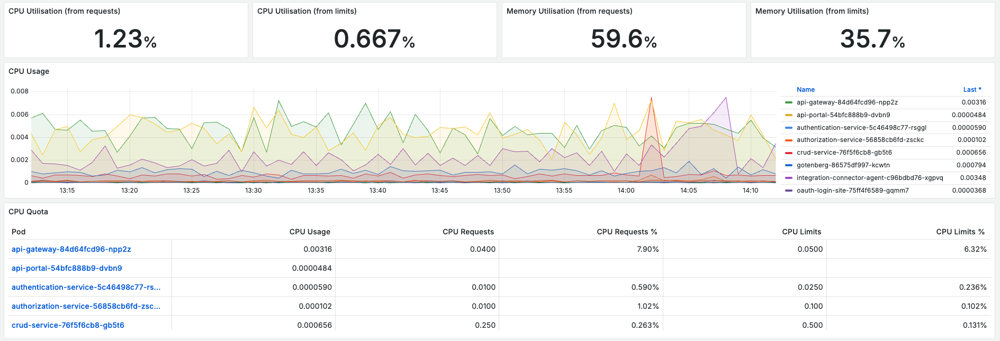

# Monitoring Mia-Care P4SaMD

Mia-Care P4SaMD is installed by the Mia-Care team, ensuring the right configuration and installation procedure. After installation, the Mia-Care team also sets up the necessary dashboards for monitoring. These dashboards can be modified based on customer needs.

The recommended tool for monitoring is the Grafana suite, composed of the following tools:

- **Prometheus**: Used for collecting and querying metrics.
- **Loki**: Used for log aggregation and querying.
- **Fluentd**: Used for log collection and forwarding.
- **Fluentbit**: A lightweight log processor and forwarder.
- **Mimir**: Used for scalable and long-term storage of metrics.

Other monitoring and logging stacks are supported, but in that case, the setup is in charge of the customer. Mia-Care can assist in setting up dashboards and alerts for these alternative stacks.

## Default Monitoring Dashboards

The default monitoring setup contains the following dashboards:

- **API Gateway Dashboard**: This dashboard traces API calls to the Mia-Care instance, highlighting error requests, average response time, and the number of requests. It helps in identifying any issues with API performance and reliability.

- **Resource Consumption**: This dashboard traces resource consumption on the Kubernetes (k8s) runtime. It provides insights into CPU, memory usage, and other critical resources to ensure the system is running efficiently.

## Alarms for Active Monitoring

Alongside dashboards, the Mia-Care team also sets up basic alarms to actively monitor the Mia-Care P4SaMD instance. These alarms include:

- **Error Count**: An alarm is raised if, within a timing window (usually 10 minutes), the number of requests that generate an error (meaning 4xx and 5xx status code replies) is greater than 5. This helps in quickly identifying and addressing issues that may affect the user experience.
- **Average Response Time**: An alarm is raised if, within a timing window (usually 10 minutes), the average response time is greater than 1 second. This ensures that the system remains responsive and performs well under load.

## Customizing Monitoring

The default monitoring setup is designed to cover the most common use cases. However, it can be customized to meet specific requirements. Customizations may include:

- Adding new dashboards to monitor additional metrics.
- Modifying existing dashboards to include more detailed information.
- Setting up additional alarms for other critical metrics.

For any modifications or customizations to the monitoring setup, please contact the Mia-Care support team. They will assist you in tailoring the monitoring to fit your specific needs.

## Alert Channels and Receivers

Alerts can be sent through different channels. By default, all alerts are sent to the Mia-Care team. During the installation phase, the customer is also invited to provide the channels they want to be set up for the alerts and the receivers of those alerts. Examples of available channels include:

- Email
- Google Chat
- Slack
- Microsoft Teams

## Accessing Monitoring Dashboards

To access the monitoring dashboards, follow these steps:

1. Log in to the Mia-Care monitoring portal using your credentials.
2. Navigate to the "Dashboards" section.
3. Select the desired dashboard (e.g., API Gateway Dashboard, Resource Consumption) to view the metrics.

## Conclusion

Effective monitoring is crucial for maintaining the performance and reliability of the Mia-Care P4SaMD instance. The default dashboards and alarms provide a solid foundation for monitoring, and the Mia-Care team is available to assist with any customizations or additional monitoring needs.

For further assistance, please contact the Mia-Care support team.
