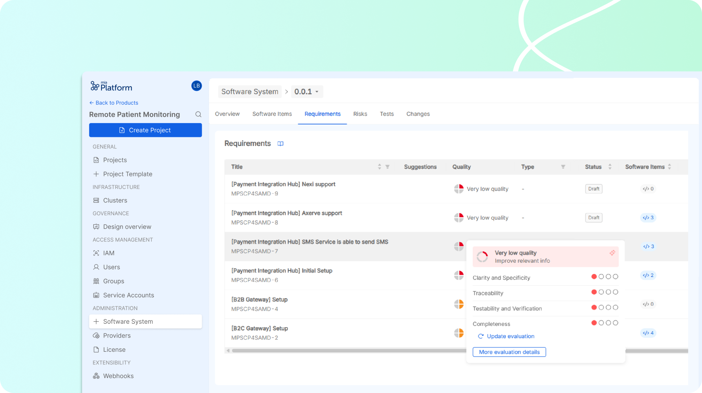

# Release Note v2.1

## AI-powered assessment of Design Input

P4SaMD introduces AI-powered features to enhance quality and accelerate the development process: the first features aim to to improve the quality of design inputs and testing

- **AI-powered Quality Evaluation**: Provides AI-based evaluation and insights about requirement and test quality and suggests improvements and identifies missing or inconsistent mandatory data. The feature reduces the team effort and improving the overall quality of specifications. The context of the AI model is set for referencing the compliance with specific criteria of reference standards, that can be tuned with respect to the target industry (e.g., healthcare with IEC 62304). 

- **Test Coverage estimation**: for each software requirement, the AI-powered tool calculates an estimation of the Test Coverage given by the verification tasks or tests that the user has associated to the requirement. The percentages of Test Coverage support the user in reaching the verification of the complete software system, ensuring the good development of the product. 

## Enhanced Software Item Management
### AI-based SWI framework
The user is supported by a structured framework to address all the newest regulatory requirements regarding the dealing with AI-based models and agent. This simplifies the software design, decreasing the cognitive load needed to include AI model while manufacturing a product (e.g., AI Act, AI-specific IMDRF guidelines and FDA directives are addressed by the tool).

### Improved Traceability 
The system now offers a robust mechanism for establishing, managing, and documenting links between Software Items (SWIs) and related entities such as Requirements, Risks, Tests, and Changes. This linking can be performed directly from the respective entity sections, ensuring comprehensive traceability. 

### Centralized Documentation References
A centralized section is now available for all the team members, from developers to QA engineers, presenting a curated list of documentation links relevant to your SaMD development. They can include regulatory references, internal Standard Operating Procedures (SOP), guidelines and other documents; customizable with tags/labels for classification and with search functionality for easy access.

### Graphical Visualization of Software Item Design
Software Items can now be visualized graphically, showing their hierarchical relationships (parent and children) up to the second level. This view provides key status information and includes a legend for clarity.

:::info 
### How to get the new version
Please [contact Mia-Care](mailto:services@mia-care.io?subject=P4SaMD%20update%20v2.1&body=Hello%20Mia-Care%20Team,%0A%0AI%20am%20interested%20in%20upgrading%20P4SaMD%20to%20v2.2%20...) to get an upgrade of P4SaMD to this brand new released version.:::

