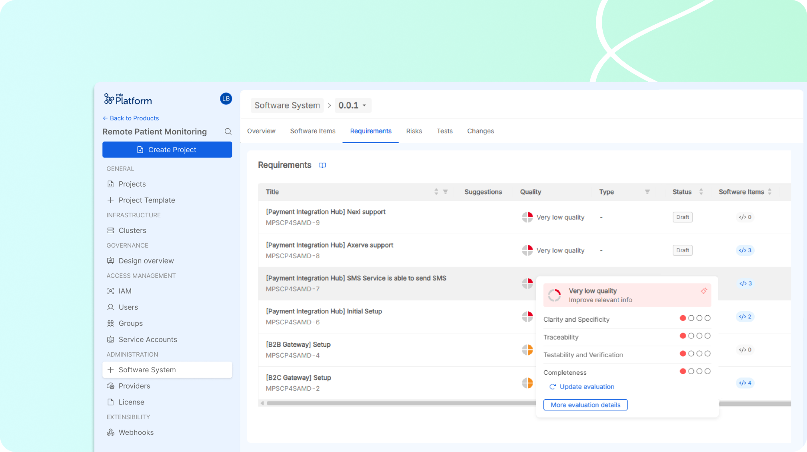

_May 28th, 2025_

## AI-powered assessment of Design Input

P4SaMD introduces AI-powered features to improve quality and accelerate development. The first ones target the quality of design inputs and testing:

- **AI-powered Quality Evaluation**: evaluates requirement and test quality, provides insights, suggests improvements and identifies missing or inconsistent mandatory data. It reduces team effort and improves the quality of specifications. The AI model context references compliance criteria from reference standards, and can be tuned to the target industry (e.g., healthcare with IEC 62304).

- **Test Coverage estimation**: for each software requirement, the AI-powered tool estimates the Test Coverage given by the verification tasks or tests the user has associated to the requirement. The Test Coverage percentages support the user in verifying the complete software system.

## Enhanced Software Item Management

### AI-based SWI framework
A structured framework guides the user through all the newest regulatory requirements for AI-based models and agents. It simplifies software design and lowers the cognitive load of including an AI model in a manufactured product. The tool addresses regulatory frameworks such as the AI Act, AI-specific IMDRF guidelines and FDA directives.

### Improved Traceability 
You can now establish, manage and document links between Software Items (SWIs) and related entities such as Requirements, Risks, Tests, and Changes. You can create these links directly from the respective entity sections.

### Centralized Documentation References
A centralized section now gives all team members, from developers to QA engineers, a curated list of documentation links relevant to your SaMD development. Links can cover regulatory references, internal Standard Operating Procedures (SOP), guidelines and other documents. Classify them with tags/labels and find them with search.

### Graphical Visualization of Software Item Design
Software Items can now be visualized graphically, showing their hierarchical relationships (parent and children) up to the second level. The view provides key status information and includes a legend.

## Released Software Item Components

| SWI                 | Version |
| ------------------- | ------- |
| P4SaMD Frontend     | v1.2.1  |
| P4SaMD Backend      | v1.3.0  |
| Pipelines Templates | v0.2.2  |
| P4SaMD AI Service   | v1.2.0  |

:::info 
### How to get the new version
[Contact Mia-Care](mailto:services@mia-care.io?subject=P4SaMD%20update%20v2.1&body=Hello%20Mia-Care%20Team,%0A%0AI%20am%20interested%20in%20upgrading%20P4SaMD%20to%20v2.2%20...) to upgrade P4SaMD to this version.
:::
