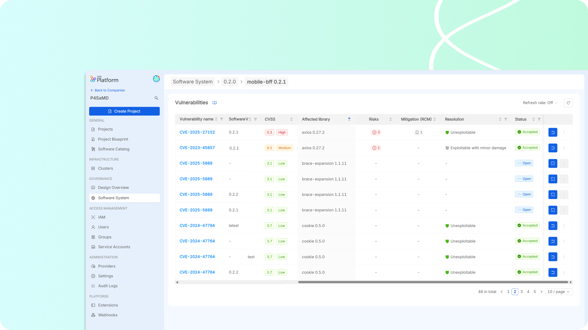

_July 18th, 2025_

## Vulnerability Management

P4SaMD now detects, tracks, and reports vulnerabilities in real time for the system version under development. Following ISO 81001-5-1, detected vulnerabilities in the implemented software can be resolved directly in the source code or accepted with a rationale justifying the action.

## Single-Sign On authentication

With Single Sign-On (SSO), you log in with your Console credentials to access the Software System dashboard.

## New Insights & Suggestions 

New warnings and informational insights for SWI management, including:

- warning of _Undocumented SWI classification_, guiding users to the regulatory requirement to justify SWI re-classification during Software System decomposition;
- inform and highlights the possible mis-classification due to incoherent decomposed SWI class;
- tool also warns the users when the design is missing for an implemented SWI;
- guidance for setting up the SWI data P4SaMD needs to work. This rule, _missing RepositoryID_, now applies only to second and third level SWIs, not to Project-level SWIs.

## Software Item Management improvements

- **Customizable Software System Settings**: users can now include or exclude specific Console Projects from their system view, keeping the documentation relevant

- **Enhanced SWI Management**: new properties improve reusability of Software Items (SWI) and track approvals and documentation.

## Minor improvements & Bugs

### Dashboard
The insights and suggestions counts now use color coded chips and correctly aligned elements.

### Test section
Test details now show the entire description to be performed and the current assignee of the test execution.

## Released Software Item Components

| SWI                 | Version |
| ------------------- | ------- |
| P4SaMD Frontend     | v1.3.1  |
| P4SaMD Backend      | v1.4.1  |
| Pipelines Templates | v0.2.2  |
| P4SaMD AI Service   | v1.2.0  |

:::info 
### How to get the new version
[Contact Mia-Care](mailto:services@mia-care.io?subject=P4SaMD%20update%20v2.2&body=Hello%20Mia-Care%20Team,%0A%0AI%20am%20interested%20in%20upgrading%20P4SaMD%20to%20v2.2%20...) to upgrade P4SaMD to this version.
:::
