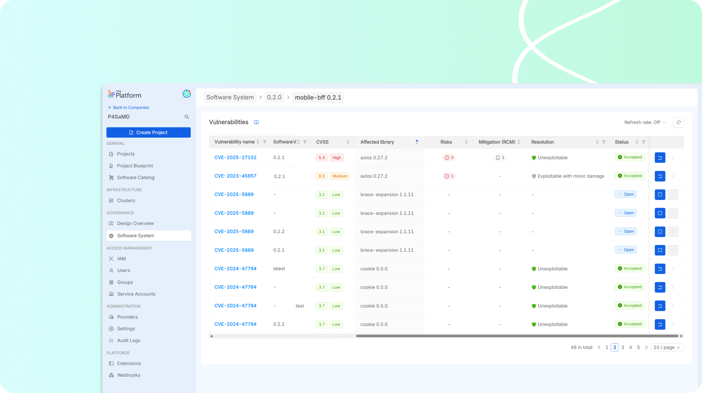

# Release Note v2.2

## Vulnerability Management

P4SaMD now allows the real-time detection, tracking, and reporting of vulnerabilities in the system version under development. Following the ISO 81001-5-1, the detected vulnerabilities of the implemented software can be resolved directly in the source code or accepted, reporting a rationale to justify the action.  

## Improved Roles & Permissions management with Single-Sign On 
Integrating the Single Sign-On (SSO), the tool offers a more customized user experience allowing customization on P4SaMD permissions for each role of the Company enabling improved governance. Furthermore, it enables a seamless login to access the Software System dashboard. 

## New Insights & Suggestions 
New warnings and informational insights for SWI management, including 
- warning of _Undocumented SWI classification_ that guides the user to meet the regulatory requirement of justification for SWI re-classification during the Software System decomposition; 
- inform and highlights the possible mis-classification due to uncoherent decomposed SWI class 
- tool also warns the users when the design is missing for an implemented SWI
- information guidance for setting up important SWI data, propedeutic for corrrect P4SaMD proper functioning. This rule, referring to _missing RepositoryID_, is now applied only for second and third level SWIs, not on Project-level SWIs. 

## Software Item Management improvements
- **Customizable Software System Settings**: Users can now tailor their system view by including or excluding specific Console Projects, improving clarity and documentation relevance

- **Enhanced SWI Management**: New properties enable better reusability of Software Items (SWI) and ensure comprehensive tracking of approvals and documentation.

## Minor improvements & Bugs
### Dashboard
Graphical improvements of the insights and suggestions counts are introduced,including color coded chips and correct alignments of elements. 

### Test section
For each test, the details now show the entire description to be performed and the current assignee of the test execution. 

:::info 
### How to get the new version
Please [contact Mia-Care](mailto:services@mia-care.io?subject=P4SaMD%20update%20v2.2&body=Hello%20Mia-Care%20Team,%0A%0AI%20am%20interested%20in%20upgrading%20P4SaMD%20to%20v2.2%20...) to get an upgrade of P4SaMD to this brand new released version.
:::

