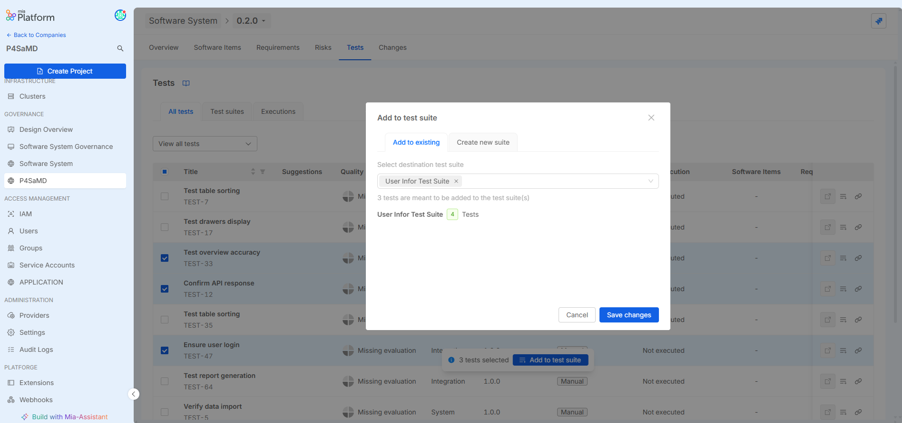

_March 18th, 2026_

The minor release v2.5 includes:
- **Test Management**: simplified workflows for test suite composition, and full support for manual and automatic tests with clearer separation between manual and automatic test management.
- **AI-powered quality evaluation**: outdated evaluations are deprecated automatically when the relevant information changes.
- **Security & Compliance**: vulnerability visualization with filtered views for implemented software items.
- **User Experience**: improved sorting and navigation of Software System Versions.

## Released Software Item Components

| SWI                 | Version |
| ------------------- | ------- |
| P4SaMD Frontend     | v1.6.1  |
| P4SaMD Backend      | v1.6.0  |
| Pipelines Templates | v0.2.3  |
| P4SaMD AI Service   | v1.3.0  |

:::info 

### How to get the new version
[Contact Mia-Care](mailto:services@mia-care.io?subject=P4SaMD%20update%20v2.2&body=Hello%20Mia-Care%20Team,%0A%0AI%20am%20interested%20in%20upgrading%20P4SaMD%20to%20v2.2%20...) to upgrade P4SaMD to this version.

:::
