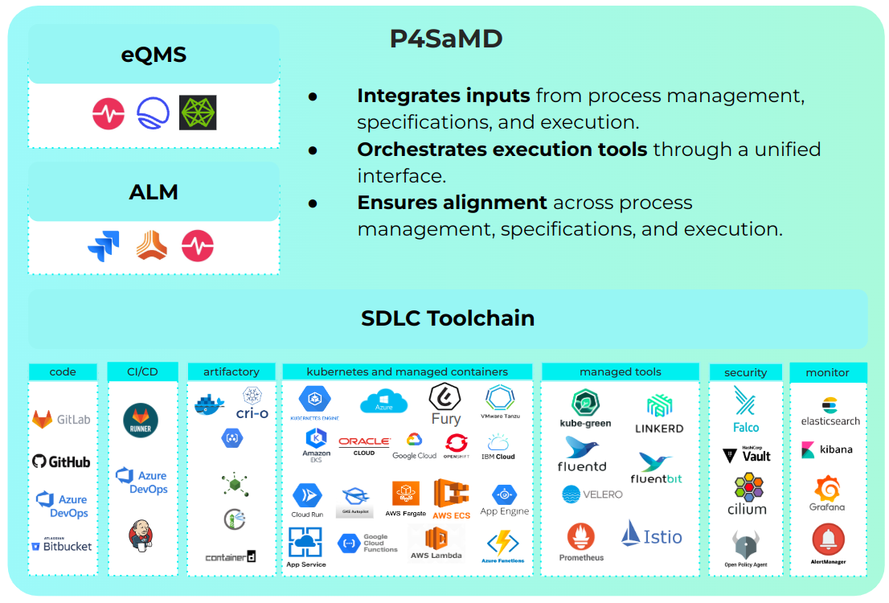

:::info

Mia-Care P4SaMD is validated to develop SaMD. For additional documentation or information, [contact us][contact-us] or check the [FAQ section][faq].

:::

This page lists the system requirements for deploying P4SaMD, including the prerequisites for Mia-Platform IDP and the ALM tool. It also describes the installation process carried out by the Mia-Care team.

## Supported tools

The table below shows the external tools officially supported for each Mia-Care P4SaMD version.

| Category | Name               | Version | Mia-Care P4SaMD version |
|----------|--------------------|---------|-------------------------|
| IDP      | Mia Platform IDP   | v14.5.2 | 2.5.0                   |
| DevOps   | GitLab             | v17.11.7| 2.5.0                   |
| ALM      | Jira REST API      | v2      | 2.5.0                   |

## Mia-Platform IDP Supported

The table below shows the minimum console version supported for each Mia-Care P4SaMD version.

| Mia-Care P4SaMD Version | State      | Minimum Mia-Platform IDP Version |
|-------------------------|------------|----------------------------------|
| 2.0                     | Supported  | 13.5                             |
| 1.0                     | Deprecated | 11.0                             |

## System Requirements

Mia-Care P4SaMD is installed on behalf of Mia-Platform IDP, so the requirement list covers components of both. Each component lists its supported tools.

<table>
   <thead>
      <tr>
         <th><strong>Required for</strong></th>
         <th></th>
         <th><strong>Tool</strong></th>
         <th><strong>Version</strong></th>
         <th><strong>Mandatory</strong></th>
      </tr>
   </thead>
   <tbody>
      <tr>
         <td rowspan="7">Mia-Platform IDP   Mia-Care P4SaMD</td>
         <td rowspan="7"><strong>Auth Provider</strong></td>
         <td>Okta</td>
         <td>SaaS</td>
         <td rowspan="7">Yes</td>
      </tr>
      <tr>
         <td>GitLab</td>
         <td>&gt; 14.x</td>
      </tr>
      <tr>
         <td>GitHub</td>
         <td>&gt; 3.x</td>
      </tr>
      <tr>
         <td>Microsoft</td>
         <td>SaaS</td>
      </tr>
      <tr>
         <td>Azure AD B2C</td>
         <td>SaaS</td>
      </tr>
      <tr>
         <td>Bitbucket Server</td>
         <td>&gt; 8.x</td>
      </tr>
      <tr>
         <td>Keycloak</td>
         <td>SaaS</td>
      </tr>
      <tr>
         <td rowspan="4">Mia-Platform IDP</td>
         <td rowspan="4"><strong>Git Provider</strong></td>
         <td>GitLab</td>
         <td>&gt; 14.x</td>
         <td rowspan="4">Yes</td>
      </tr>
      <tr>
         <td>GitHub</td>
         <td>&gt; 3.x</td>
      </tr>
      <tr>
         <td>Azure Repos</td>
         <td>SaaS</td>
      </tr>
      <tr>
         <td>Bitbucket Server</td>
         <td>&gt; 8.x</td>
      </tr>
      <tr>
         <td rowspan="2">Mia-Platform IDP</td>
         <td rowspan="2"><strong>Secret Manager</strong></td>
         <td>GitLab</td>
         <td>SaaS</td>
         <td rowspan="2">Yes</td>
      </tr>
      <tr>
         <td>Vault</td>
         <td>SaaS</td>
      </tr>
      <tr>
         <td rowspan="4">Mia-Platform IDP</td>
         <td rowspan="4"><strong>CI/CD Tool</strong></td>
         <td>GitLab CI Runners</td>
         <td>&gt; 14.x</td>
         <td rowspan="4">Yes</td>
      </tr>
      <tr>
         <td>GitHub Actions</td>
         <td>SaaS</td>
      </tr>
      <tr>
         <td>Azure Pipelines</td>
         <td>SaaS</td>
      </tr>
      <tr>
         <td>Jenkins</td>
         <td>SaaS</td>
      </tr>
      <tr>
         <td>Mia-Platform IDP   Mia-Care P4SaMD</td>
         <td><strong>NoSQL database</strong></td>
         <td>MongoDB Enterprise</td>
         <td>&gt; 5 &lt;= 7</td>
         <td>Yes</td>
      </tr>
      <tr>
         <td>Mia-Platform IDP   Mia-Care P4SaMD</td>
         <td><strong>Redis Cache</strong></td>
         <td>Redis</td>
         <td>&gt;= 6 &lt;= 7</td>
         <td>Yes</td>
      </tr>
      <tr>
         <td>Mia-Platform IDP   Mia-Care P4SaMD</td>
         <td><strong>Runtime</strong></td>
         <td>Kubernetes</td>
         <td>&gt;= 1.21 &lt;= 1.30</td>
         <td>Yes</td>
      </tr>
      <tr>
         <td rowspan="3">Mia-Platform IDP   Mia-Care P4SaMD</td>
         <td rowspan="3"><strong>Object Storage</strong></td>
         <td>Google Cloud Storage</td>
         <td>SaaS</td>
         <td rowspan="3">Yes</td>
      </tr>
      <tr>
         <td>S3-Compatible Object Storages</td>
         <td>SaaS</td>
      </tr>
      <tr>
         <td>MongoDB</td>
         <td>SaaS</td>
      </tr>
      <tr>
         <td>Mia-Care P4SaMD</td>
         <td><strong>Application Lifecycle Manager (ALM)</strong></td>
         <td>JIRA</td>
         <td>SaaS</td>
         <td>Yes</td>
      </tr>
      <tr>
         <td rowspan="2">Mia-Platform IDP</td>
         <td rowspan="2"><strong>Key Management Service</strong></td>
         <td>Google Cloud Platform</td>
         <td>SaaS</td>
         <td rowspan="2">Optional</td>
      </tr>
      <tr>
         <td>Local Key</td>
         <td>SaaS</td>
      </tr>
      <tr>
         <td>Mia-Platform IDP</td>
         <td><strong>Container image registry</strong></td>
         <td>Any container image registry</td>
         <td>SaaS</td>
         <td>Optional</td>
      </tr>
   </tbody>
</table>

### Kubernetes Cluster Setup
The Kubernetes cluster must be configured with the components below, which cover the correct operation and monitoring of the application.
Each component lists a set of recommended tools.
Customers can customize the Kubernetes cluster setup based on tools available in their portfolio.

| Component                  | Mandatory | Recommended Tools                                 |
|:---------------------------|:---------:|:--------------------------------------------------|
| Ingress Controller         |    Yes    | Traefik                                           |
| Certificate Manager        | Optional  | cert-manager                                      |
| Monitoring & Logging Stack | Optional  | Grafana + Prometheus + Loki + Fluentd + Fluentbit |
| Disaster Recovery          | Optional  | Velero                                            |

### Enhanced workflow

Mia-Care P4SaMD requires all Console projects to use [Enhanced Project Workflow][enhanced-project-workflow], which uses GitOps integrations to provide observability and traceability over the project runtime.

## Installation Procedure

Only Mia-Care's qualified personnel install Mia-Care P4SaMD. The procedure has the following stages:

1. **System Requirements Check**: Mia-Care personnel validate the system environment for compatibility and readiness. This step includes:
   - **Infrastructure Assessment:** Verifying hardware and software configurations meet minimum requirements.
   - **Networking Validation:** Checking that network settings meet the operational needs of Mia-Care P4SaMD.
   - **Security Checks:** Verifying compliance with the relevant standards and securing the installation environment.

2. **Installation of Mia-Platform IDP**: Mia-Platform IDP (Integrated Development Platform) is deployed in the prepared environment and configured according to project-specific requirements.

3. **Post-Installation Testing of Mia-Platform IDP**: Testing confirms that the platform operates correctly. This includes:
   - Functionality testing to confirm all features are accessible.
   - Performance testing to ensure stability under expected workloads.
   - Validation of integrations to confirm compatibility with the ecosystem.

4. **Installation of Mia-Care P4SaMD**: Once the Mia-Platform IDP installation is verified, the Mia-Care P4SaMD application is installed and configured for the intended use and the environment specifications.

5. **Post-Installation Testing of Mia-Care P4SaMD**: Testing of Mia-Care P4SaMD then validates that:
   - Core functionalities and workflows operate as designed.
   - Performance and responsiveness meet predefined benchmarks.
   - Security measures are effectively implemented.

6. **Installation and Operation Qualification Report**: After all tests pass, Mia-Care personnel prepare the **Installation & Operation Qualification Report**. It is the formal evidence of a completed installation process and includes:
   - A summary of activities conducted during the installation.
   - Results of system checks and testing.
   - Approval and sign-off by the Mia-Care team, certifying that the system is operational and meets quality standards.

For further information or support, contact Mia-Care's technical support team.

[contact-us]: https://mia-care.io
[enhanced-project-workflow]: https://docs.mia-platform.eu/docs/development_suite/set-up-infrastructure/enhanced-project-workflow
[faq]: faq.mdx