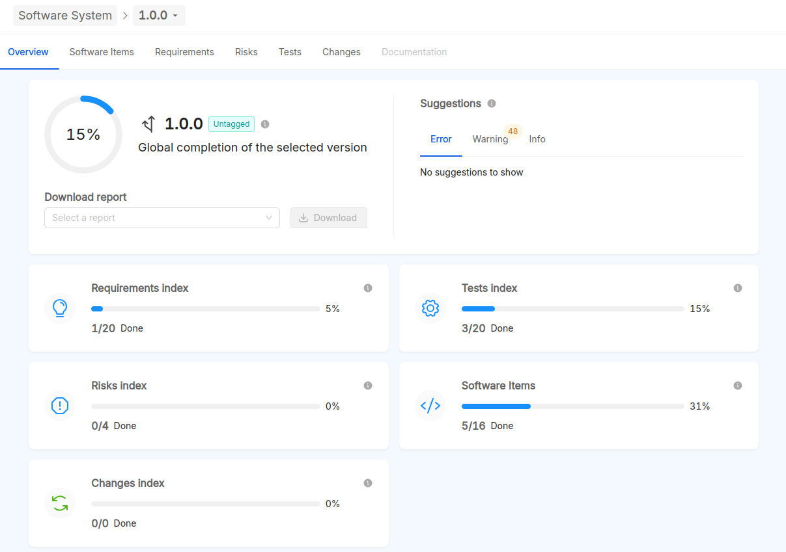

# System Overview

## Introduction
The **Overview** tab provides a centralized summary of the progress and key metrics for the selected **system version**. Once a system version is chosen, the Overview tab automatically updates to display all relevant information tied to that version. This page is designed to give users a clear, real-time snapshot of their progress across various software development areas, making it easier to monitor and manage the development lifecycle effectively.

## KPIs
At the core of the Overview tab is a **progress bar** that reflects the overall **completion percentage** of the entities associated with the selected system version. The calculation of each Key Performance Indicator (KPI) is based on the ratio of **correctly resolved issues** to the **total number of issues** for each specific entity.

Below the global progress bar, users will find a series of **detailed progress bars** that break down the completion status for each type of entity:
- **Requirements**: Tracks the implementation and approval status of defined requirements.
- **Risks**: Reflects the identification, assessment, and mitigation of risks.
- **Tests**: Monitors the execution and success of validation and verification activities.
- **Software Items**: Tracks the completion and review status of individual software components.
- **Change Requests**: Shows the resolution of requested changes across the system version.

These KPIs provide actionable insights, enabling teams to measure progress and focus on areas requiring immediate attention.

## Reports
Directly beneath the overall progress bar, a **select dropdown menu** enables users to generate and download reports tailored to the selected system version. The following reports are available:
- **Release Note**: Summarizes the key updates, features, and resolved issues in the system version.
- **Risk Report**: Provides a detailed analysis of identified risks, their risk control measures and current statuses.
- **Test Report**: Lists all tests performed, their results, and any associated observations or issues.
- **Change Report**: Documents all approved and implemented change requests.
- **SOUP Report**: Details the use of all Software of Unknown Provenance (SOUP).
- **Changelogs**: A folder containing the changelogs of each custom software components.
- **Unit Tests**: Presents the outcomes and coverage of unit tests performed on custom software components.

These reports ensure compliance, traceability, and readiness for audits or external reviews.

For additional information about the available reports, please take a look at the [dedicated section](reports.md).

## Suggestions
On the right-hand side of the Overview tab, the **Suggestions box** provides tailored recommendations to enhance compliance with industry regulations governing the development of Software as a Medical Device (SaMD), such as **IEC 62304**. These suggestions are aimed at improving quality, mitigating risks, and ensuring that all development activities align with regulatory standards.

Suggestions are categorized into three levels of severity:
- **Error**: Critical issues that must be addressed immediately to meet compliance and avoid major risks.
- **Warning**: Issues that, while not critical, could lead to compliance gaps or delays if not resolved.
- **Info**: General recommendations or observations that can enhance process efficiency or documentation quality. These are non-mandatory but provide valuable insights, such as optimization opportunities or additional audit notes.

By addressing these suggestions, teams can proactively ensure regulatory compliance and maintain high standards throughout the software lifecycle.
