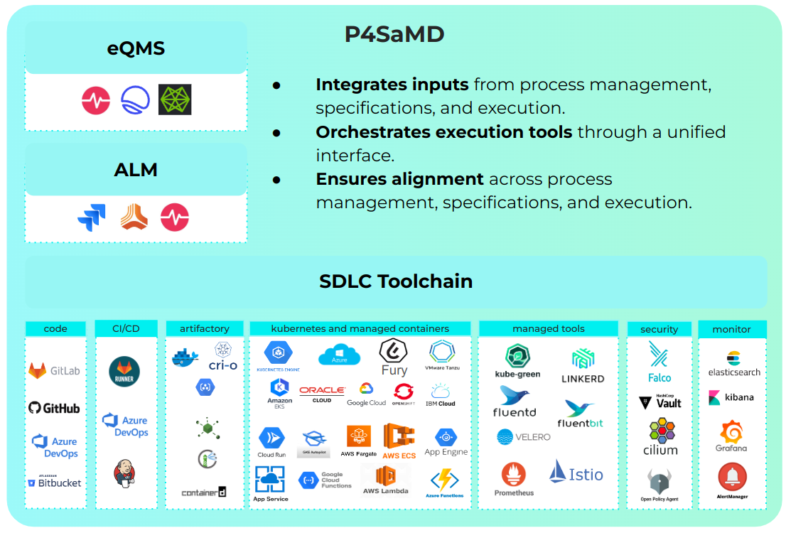

:::info

Mia-Care P4SaMD is validated to develop SaMD, if you need additional documentation or information please [contact us][contact-us] or check the [FAQ section][faq].

:::

This page provides an overview of the system requirements necessary for deploying P4SaMD and explains how the installation process is carried out by the Mia-Care team.

The deployment of Mia-Care P4SaMD involves a structured process to ensure compatibility with your existing infrastructure and alignment with regulatory and operational needs. It includes:

- A detailed list of system requirements, including prerequisites for the Mia-Platform IDP, the need for an ALM tool, and the supported adoption models.
- A description of the installation process, highlighting the infrastructure assessment, installation steps, and the validation phase conducted by Mia-Care.

## Supported tools

The table below shows the external tools officially supported for each Mia-Care P4SaMD version.

| Category | Name               | Version | Mia-Care P4SaMD version |
|----------|--------------------|---------|-------------------------|
| IDP      | Mia Platform IDP   | v14.4.0 | 2.3.1                   |
| DevOps   | GitLab             | v17.11.7 | 2.0.0                   |
| ALM      | Jira REST API      | v2      | 2.0.0                   |

## System Requirements

Mia-Care P4SaMD is installed on behalf of Mia-Platform IDP, meaning the system requirement list contains both Mia-Platform IDP and Mia-Care P4SaMD components. For every component, a list of supported tool is presented. In the end, a target tech stack is presented.

The supported providers are listed in the [Mia-Platform documentation](https://docs.mia-platform.eu/docs/infrastructure/self-hosted/self-hosted-requirements#architectural-prerequisites), at the reference IDP validated version present in the table above.  

### Kubernetes Cluster Setup
The Kubernetes cluster must be configured with a set of components that ensure the correct operation and monitoring of the application.
The components needed for the Kubernetes runtime are shown below.
For every component is provided a set of recommended tools.
Customers can customize the Kubernetes cluster setup based on tools available in their portfolio.

| Component                  | Mandatory | Recommended Tools                                 |
|:---------------------------|:---------:|:--------------------------------------------------|
| Ingress Controller         |    Yes    | Traefik                                           |
| Certificate Manager        | Optional  | cert-manager                                      |
| Monitoring & Logging Stack | Optional  | Grafana + Prometheus + Loki + Fluentd + Fluentbit |
| Disaster Recovery          | Optional  | Velero                                            |

### Enhanced workflow

Mia-Care P4SaMD requires all Console projects to use [Enhanced Project Workflow][enhanced-project-workflow], since leverages GitOps integrations to provide observability and traceability over the project runtime.

## Installation Procedure

The installation of Mia-Care P4SaMD is a structured process performed exclusively by Mia-Care's qualified personnel. This ensures that the solution is implemented efficiently and adheres to high-quality standards. Below is an overview of the installation procedure, divided into specific stages:

1. **System Requirements Check**: Mia-Care personnel begin by validating the system environment to ensure compatibility and readiness for installation. This step includes:
   - **Infrastructure Assessment:** Verifying hardware and software configurations meet minimum requirements.
   - **Networking Validation:** Ensuring that network settings align with the operational needs of Mia-Care P4SaMD.
   - **Security Checks:** Conducting security assessments to verify compliance with relevant standards and safeguard the installation environment.

2. **Installation of Mia-Platform IDP**: Mia-Platform IDP (Integrated Development Platform), a foundational component, is installed in the prepared environment. This phase involves deploying the platform and configuring it according to project-specific requirements.

3. **Post-Installation Testing of Mia-Platform IDP**: Once Mia-Platform IDP is installed, rigorous post-installation testing is conducted to ensure the platform operates correctly. This includes:
   - Functionality testing to confirm all features are accessible.
   - Performance testing to ensure stability under expected workloads.
   - Validation of integrations to confirm compatibility with the overall ecosystem.

4. **Installation of Mia-Care P4SaMD**: After verifying the successful installation of Mia-Platform IDP, the Mia-Care P4SaMD application is installed. This involves configuring the solution to align with the intended use and environment specifications.

5. **Post-Installation Testing of Mia-Care P4SaMD**: Following the installation, comprehensive testing of Mia-Care P4SaMD is performed to validate:
   - Core functionalities and workflows operate as designed.
   - Performance and responsiveness meet predefined benchmarks.
   - Security measures are effectively implemented.

6. **Installation and Operation Qualification Report**: Upon successful completion of all tests, Mia-Care personnel prepare the **Installation & Operation Qualification Report**. This document serves as formal evidence of a completed installation process, including:
   - A summary of activities conducted during the installation.
   - Results of system checks and testing.
   - Approval and sign-off by the Mia-Care team, certifying that the system is operational and meets quality standards.

This phased approach ensures a smooth deployment of Mia-Care P4SaMD, with high levels of reliability and performance, while adhering to strict security and compliance requirements. For further information or support, please contact Mia-Care's technical support team.

[contact-us]: https://mia-care.io
[enhanced-project-workflow]: https://docs.mia-platform.eu/docs/development_suite/set-up-infrastructure/enhanced-project-workflow
[faq]: faq.md
